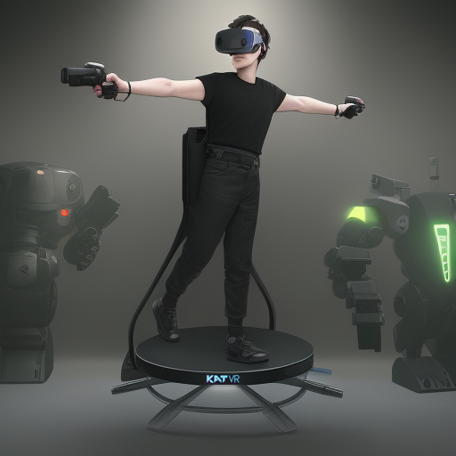

# Vertigo2_Katwalk
A KatWalk SDK integration mod into Vertigo 2

  

## Features:

* Uses official KatWalk SDK
* Better speed integration based on the real-life speed on the KatWalk
* Modifikations within a new Tab-Menu "KatWalk" in the options
* Auto recalibration

## How To Install & Use

* Download [MelonLoader](https://github.com/LavaGang/MelonLoader/releases) (at least version 0.6.0), open the downloaded Installer and Select the Game's .exe `Vertigo 2\vertigo2.exe`. Press `Install`.
* Download the zip from [here](https://github.com/McFredward/Vertigo2_Katwalk/releases) and unzip the files into `Vertigo 2\Mods`.
* Start the KatWalk Gateway
* **Turn the Walk- and Run-Source to None in the Gateway for Vertigo 2**, since the Gateway directly communicates with the game. There is no need to simulate the Joystick anymore and it could lead to unintended behavior.
* Start the game
* Recommended to turn off joystick-turning in the options. Every time you use joystick-turning you have to recalibrate!

## Modification values

* **Speed Multiplicator**: Modifies how the speed of the KatWalk is translated to the in-game speed.
* **Speed max. Range**: Modifies what maximal ingame speed value corresponds to the maximal KatWalk speed.
* **Speed curve exponent**: Modifies the speed curve which determines how fast the maximal speed is reached. 

## Known issues

* Backwards walking is not working like with the Joystick emulation (seems like the SDK dont support it right now)
* ~~Interacting with vehicles that forcibly turn the player can cause a misalignment of the head and player rotation, requiring manual recalibration. I will continue to search for a better solution when time permits.~~ Fixed in v.1.1.0

## Credits & Libs

* [Official KatWalk SDK](https://drive.google.com/drive/folders/1K_0q1YWth80dl7g8LF57xoSN1YndUvM-)
* [HarmonyLib](https://github.com/pardeike/Harmony) using the MIT License
* [MelonLoader](https://github.com/LavaGang/MelonLoader) using the Apache-2.0 license

If you have any suggestions, feel free to open an Issue. Or contact me (McFredward) in the [KatWalk Discord](https://discord.gg/kat-vr-community-785305088465567824).

